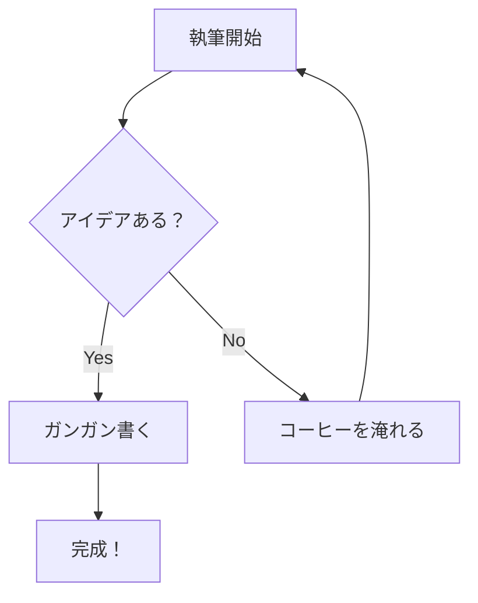
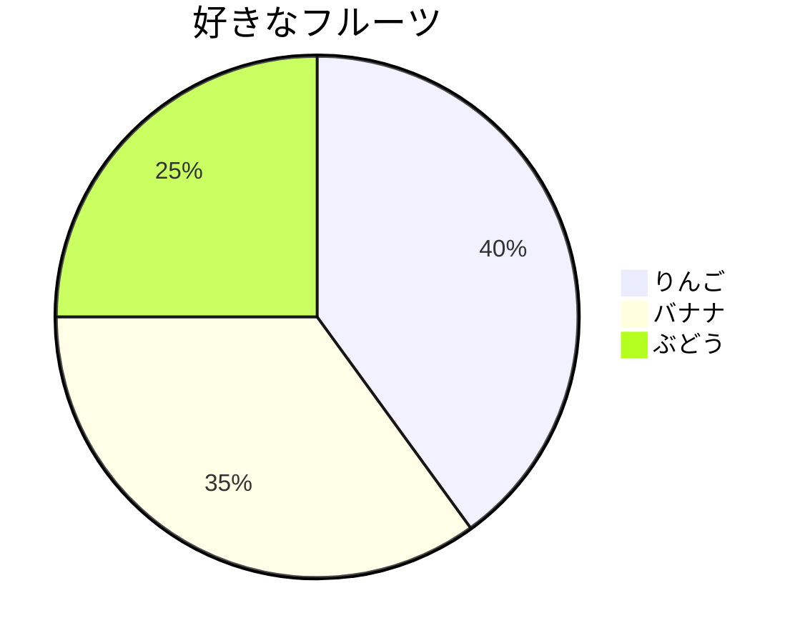
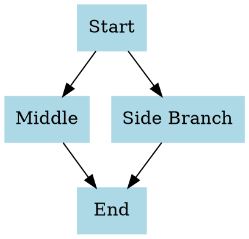

# MarkdownEditer 🚀

**MarkdownEditer** は、あなたの思考をシームレスに文章にするために作られた次世代の Markdown エディタです。
Tauri と Rust、CodeMirror 6 の力により、ネイティブアプリのような軽快な動作と、高度なプレビュー機能を兼ね備えています。

このガイドでは、MarkdownEditer で利用できるすべての機能や記法について解説します。
左側で編集を試しつつ、右側のリアルタイムプレビューでどう表示されるか確認してみましょう！

---

## 📖 目次

- [🚀 特徴](#特徴)
- [📝 基本的なテキスト装飾](#基本的なテキスト装飾)
- [📚 見出しとリスト](#見出しとリスト)
- [🖼️ リンクと画像](#リンクと画像)
- [💻 コードと引用](#コードと引用)
- [📊 テーブルと水平線](#テーブルと水平線)
- [🧮 数式 (TeX / MathJax)](#数式-tex--mathjax)
- [🎨 Mermaid ダイアグラム](#mermaid-ダイアグラム)
- [🌿 PlantUML 図表](#plantuml-図表)
- [⌨️ ショートカットキー一覧](#ショートカットキー一覧)

---

## 🚀 特徴

1. **リアルタイムな同期スクロール**: 長い文章を書いていても迷子になりません。
2. **ドラッグ＆ドロップ感覚の画像リサイズ**: プレビューの画像の右下を引っ張るだけで、Markdownソースのコードが自動で追従します。
3. **右クリック・クイック装飾**: 複雑な記法を覚えていなくても、右クリックメニューから一発で装飾できます。
4. **目の負担を軽減するダークテーマ**: 深夜の作業でも集中力が途切れません。
5. **読み取り専用モード**: 完成した文章を確認する際、ワンクリックで画面全体をプレビュー専用に切り替えられます。

---

## 📝 基本的なテキスト装飾

| 書き方 | 表示 | スタイル |
|--------|------|:---:|
| `**太字**` | **太字** | 強調したいときに使います |
| `*斜体*` | *斜体* | 軽めの強調に使います |
| `~~打ち消し~~` | ~~打ち消し~~ | 完了した項目や訂正に使います |
| `` `インラインコード` `` | `インラインコード` | 短いプログラムコードやキー入力に使います |
| `**_複合_**` | **_太字+斜体_** | さらに強く目立たせます |

> 💡 **Tip:** テキストをドラッグして選択状態にし、**右クリック** すると上記の装飾をメニューから簡単に選べます！

---

## 📚 見出しとリスト

### 見出し (Heading)

行頭に `#` を付けることで、見出しを作成できます。`#` の数によって大きさが変わります。

```
# 見出し 1（最も大きい）
## 見出し 2
### 見出し 3
#### 見出し 4
```

### 箇条書きリスト

`-` や `*` を行頭に置くと、順序のないリストになります。
Tab キーで字下げすると、ネスト（入れ子）させることもできます。

- りんご
- みかん
  - ネーブル
  - 温州
- ぶどう

### タスクリスト

リストの記法に `[ ]` や `[x]` を組み合わせることで、チェックボックスを作れます。

- [x] アイデアをまとめる
- [x] 構成を練る
- [ ] 原稿を執筆する

### 番号付きリスト

数字とピリオド `1.` を使うと、順序のあるリストになります。

1. 企画書作成
2. 要件定義
3. 設計・実装

---

## 🖼️ リンクと画像

### リンク

テキストにクリック可能なリンクを貼るには、このように書きます。

`[Google](https://google.com)` → [Google](https://google.com)

### 画像

画像のリンクの前に `!` を付けると、画像を埋め込むことができます。

```markdown

```


> ✨ **MarkdownEditer 専用の魔法:**  
> 上に表示されている**画像の右下の角をマウスでドラッグ**してみてください。 
> あなたの操作に合わせて、記述されている Markdown ソースが `` に自動変換されます！

---

## 💻 コードと引用

### コードブロック

````markdown
```javascript
const message = "MarkdownEditer は最高です！";
console.log(message);
```
````

```javascript
const message = "MarkdownEditer は最高です！";
console.log(message);
```

### 引用

行頭に `>` をつけると引用ブロックになります。

> これは引用です。
> 他の記法（**太字** など）と混ぜることもできます。

---

## 📊 テーブルと水平線

### テーブル（表）

パイプ `|` とハイフン `-` を組み合わせて表を作ります。コロン `:` を使って配置の指定も可能です。

```markdown
| 左揃え | 中央揃え | 右揃え |
| :--- | :---: | ---: |
| 100 | 200 | 300 |
| りんご | バナナ | チェリー |
```

| 左揃え | 中央揃え | 右揃え |
| :--- | :---: | ---: |
| 100 | 200 | 300 |
| りんご | バナナ | チェリー |

### 水平線

`---` または `***` を入力すると、区切り線が引けます。

---

## 🧮 数式 (TeX / MathJax)

コードブロックの言語名に `math` を指定するか、インラインで `$` で囲むと、美しい数式がレンダリングされます。

**インライン数式:**  
アインシュタインの有名な方程式は $E = mc^2$ です。

**ディスプレイ数式:**  
```math
\int_{-\infty}^{\infty} e^{-x^2} dx = \sqrt{\pi}
```

配列や行列も記述可能です。
```math
A = \begin{pmatrix}
  a & b \\
  c & d
\end{pmatrix}
```

---

## 🎨 Mermaid ダイアグラム

コードブロックの言語名を `mermaid` にすると、フローチャートや各種グラフをテキストベースで簡単に描画できます。すべてアプリ内で**オフライン処理**されます。

### フローチャート



### 円グラフ



---

## 🌿 PlantUML 図表

コードブロックの言語名を `uml` にすると、ソフトウェア設計に必要なシーケンス図やクラス図を描画できます。
> ⚠️ 注意: PlantUML の描画にはインターネット接続が必要です。

### シーケンス図

```uml
actor ユーザー
participant "UI (JavaScript)" as FE
participant "コア (Rust)" as BE

ユーザー -> FE : 保存ボタンを押す
FE -> BE : invokes save_file()
BE --> FE : Success!
FE --> ユーザー : 保存完了を通知
```

---

## 🎨 追加ダイアグラム (D2, WaveDrom, Vega, Graphviz, ABC, bytefield)

MarkdownEditer では、専門的な情報や仕様を視覚化するための6つの強力な図法記法をさらにサポートしています。

### D2 (Declarative Diagramming)
言語名 `d2` 。モダンで強力なテキストベースのダイアグラム作成言語です。

```d2
x -> y: hello
y -> z: world
x -> z: hello world
```

### WaveDrom (デジタル論理波形)
言語名 `wavedrom` 。ハードウェアのタイミングチャートやレジスタ図を描画できます。

```wavedrom
{ signal: [
  { name: "clk",         wave: "p.....|..." },
  { name: "Data",        wave: "x.345x|=.x", data: ["head", "body", "tail", "data"] },
  { name: "Request",     wave: "0.1..0|1.0" },
  {},
  { name: "Acknowledge", wave: "1.....|01." }
]}
```

### Vega / Vega-Lite (データ可視化)
言語名 `vega` または `vega-lite` 。JSON を用いてグラフやチャートを柔軟にプロットできます。

```vega-lite
{
  "$schema": "https://vega.github.io/schema/vega-lite/v5.json",
  "description": "シンプルな棒グラフ",
  "data": {
    "values": [
      {"a": "A", "b": 28}, {"a": "B", "b": 55}, {"a": "C", "b": 43},
      {"a": "D", "b": 91}, {"a": "E", "b": 81}, {"a": "F", "b": 53}
    ]
  },
  "mark": "bar",
  "encoding": {
    "x": {"field": "a", "type": "nominal", "axis": {"labelAngle": 0}},
    "y": {"field": "b", "type": "quantitative"}
  }
}
```

### Graphviz / DOT言語
言語名 `dot` または `graphviz` 。ネットワーク構造や依存関係の描画に最適です。



### ABC Notation (楽譜)
言語名 `abc` 。テキストから五線譜をレンダリングします。演奏用の標準的なフォーマットです。

```abc
X:1
T:きらきら星 (Twinkle Twinkle Little Star)
M:4/4
L:1/4
K:C
C C G G | A A G2 | F F E E | D D C2 |
G G F F | E E D2 | G G F F | E E D2 |
C C G G | A A G2 | F F E E | D D C2 |]
```

### bytefield-svg (プロトコル・メモリマップ)
言語名 `bytefield` 。バイナリデータの構造やパケットフォーマットを描画するのに適しています。

```bytefield
(defattrs :bg-green {:fill "#a0ffa0"})
(defattrs :bg-yellow {:fill "#ffffa0"})

(draw-column-headers)
(draw-box "Flags" {:span 4})
(draw-box "Status" {:span 4})
(draw-box "Command" {:span 8})
(draw-box "Address" {:span 16 :class "bg-green"})
(draw-box "Data 1" {:span 16 :class "bg-yellow"})
(draw-box "Data 2" {:span 16 :class "bg-yellow"})
```

---

## ⌨️ ショートカットキー一覧

作業効率を上げる強力なキーボードショートカットたちです。

| 操作 | Windows |
| --- | --- |
| **ファイルを保存** | `Ctrl` + `S` |
| **名前をつけて保存** | `Ctrl` + `Shift` + `S` |
| **ファイルを開く** | `Ctrl` + `O` |
| **プレビュー切替** | `Ctrl` + `Shift` + `P` |
| **コンテキストメニュー** | （テキスト選択時に） `右クリック` |
| **元に戻す** | `Ctrl` + `Z` |
| **やり直す** | `Ctrl` + `Y` |

---

> 🎉 早速、自分だけのファイルを作成したり保存したりして、新しいライティング環境をお楽しみください！
